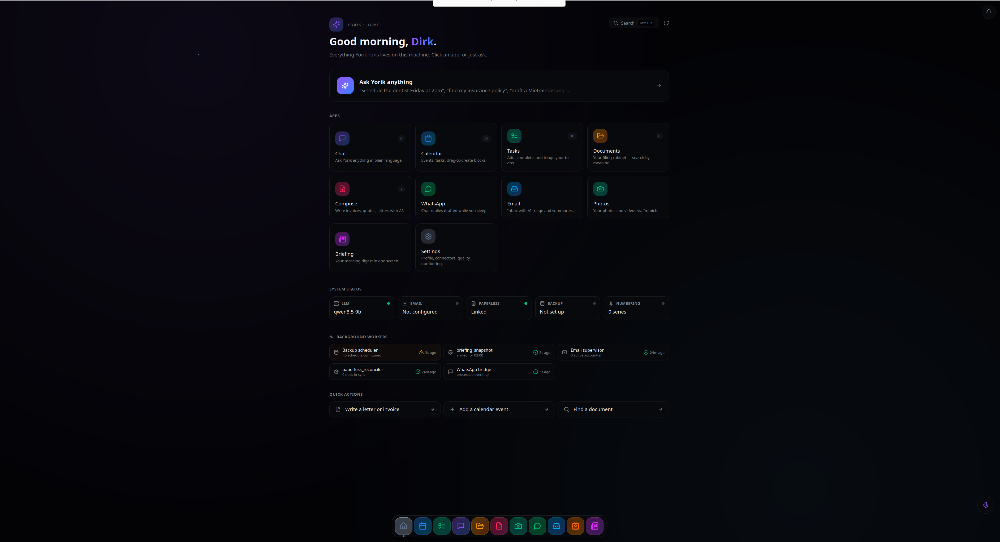
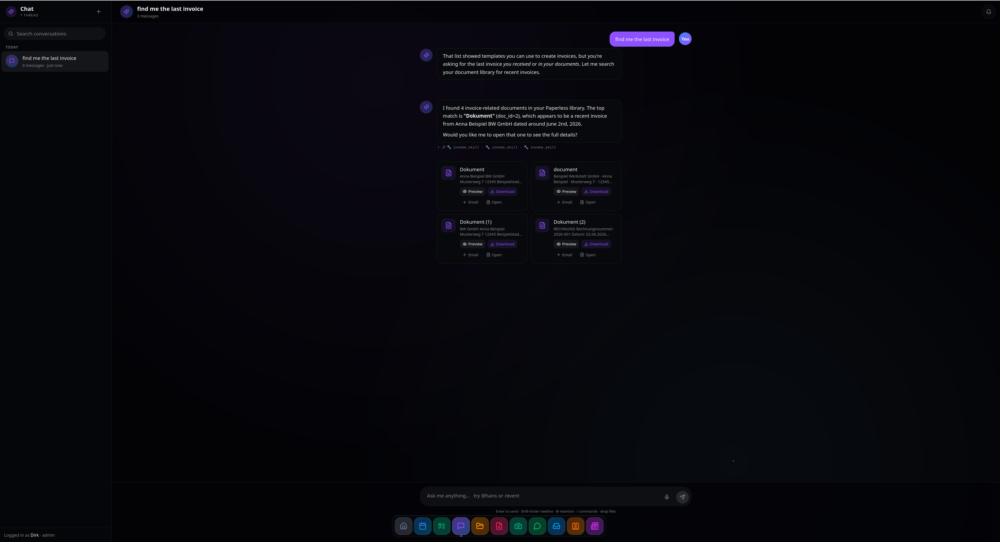
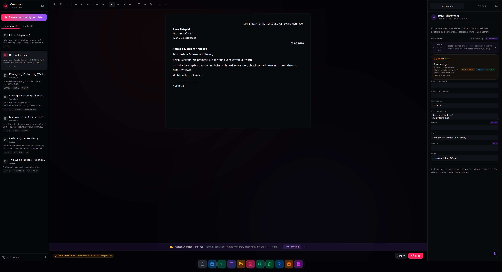
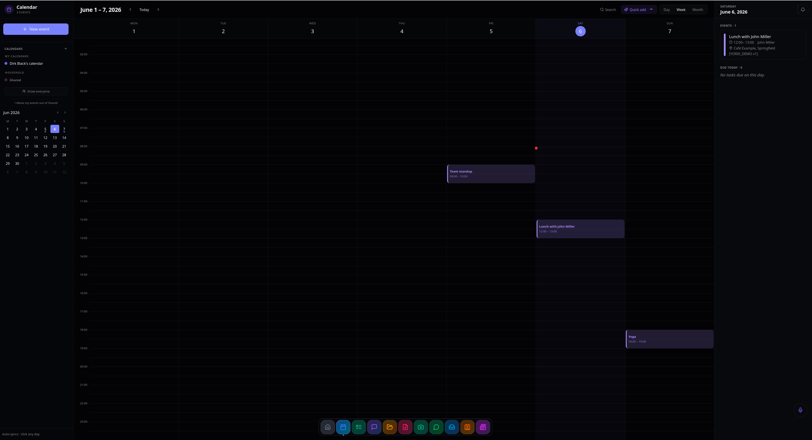
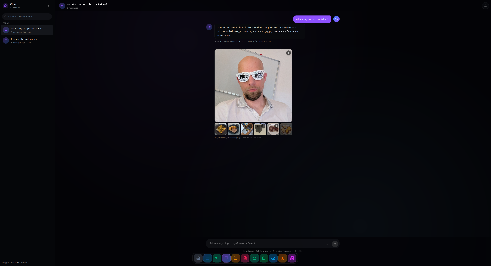

# Yorik

**Yorik aspires to be your butler — times 10.** A self-hosted personal OS that handles your calendar, photos, documents, email, WhatsApp, and (for German users) e-invoicing through one chat-driven interface. Voice-aware. Runs on your own machine. No cloud, no subscription, no telemetry.

> ### ⚠️ Early rolling alpha. Expect bugs.
>
> Core features work on the maintainer's box and pass automated tests, but
> Yorik hasn't been field-tested by anyone else yet. The security audit was
> done **today**. Don't run it on a machine that holds data you can't lose.
>
> The most valuable thing you can do right now is install it, hit the rough
> edges, and file a bug report via the
> [template](https://github.com/winidi/yorik-ai/issues/new/choose) — it
> prompts for OS, LLM endpoint, the failing action, and a log tail.
>
> What NOT to do with this alpha:
> - Run it as your only photo or document backup
> - Expose it to the internet without a reverse proxy + auth in front
> - Trust the invoice numbers for tax filing without manual verification

## What it looks like

https://github.com/user-attachments/assets/cff3dbc7-9411-4144-ba67-3ffef706771c

▶ **[Watch in HD on YouTube](https://www.youtube.com/watch?v=EF9hW-CjKPg)** — 2-minute walkthrough: Yorik finding documents, finding photos, drafting an email, all from one chat interface.

**Home** — "Good morning, Dirk." Apps grid, system status, background workers, quick actions. Everything Yorik runs lives on this machine.


**Chat finds your documents** — ask "find me the last invoice" and Yorik searches Paperless, surfaces the top matches inline as clickable cards with citations to the source doc.


**Compose** — template picker, DIN 5008 letter preview, structured args (recipient address, betreff, signature) on the right. The pipeline runs `pick_compose_template → compose_check_recipient → compose_check_template_args → compose_draft` and adapts tone to the recipient (formal "Sehr geehrte" for businesses, "Hallo Anna" for friends).


**Calendar** — week view with event chips, conflict-aware travel-time blocks, side panel showing the day's agenda. Shared and personal calendars per user.


**Chat finds your photos** — "what's my last picture taken?" returns the actual photo inline, served through Yorik's proxy from your local Immich library. Same pattern for `find_photo(of_person="Anna")` or CLIP-content queries like "photos from the beach".


Click **Seed demo data** on Home after install to reproduce this state. For a fuller dataset (~22 contacts, ~23 events, ~12 tasks): `python scripts/seed-demo-data.py` with the venv active.

## Install

Fresh Ubuntu 24.04+ / Debian 12+ / Fedora 39+, ≥8 GB RAM (16 recommended), ≥30 GB free disk. Works inside WSL2 Ubuntu 24 with the same script (with a couple of WSL caveats it'll print). macOS uses a separate path — see [docs/INSTALL.md](docs/INSTALL.md).

```bash
git clone https://github.com/winidi/yorik-ai && cd yorik-ai
bash install.sh              # one-shot: deps + Docker + LLM + Yorik
```

The installer pre-checks RAM/disk/ports/network, installs system packages, sets up Docker, and picks an LLM strategy automatically:

- **Existing LLM running on `:8080` / `:11434` / `:1234` / `:8081` / `:5000`** → uses it.
- **NVIDIA GPU detected** → installs `ghcr.io/ggml-org/llama.cpp:server-cuda` + the unsloth Qwen3.5-9B Q4_K_M GGUF + vision projector. Best fidelity; matches the maintainer's setup.
- **No GPU** → installs Ollama + `robit/qwen3.5-9b-r7-research-vision:q4km` (vision works, slightly distilled text behavior).

Override the LLM choice: `bash install.sh --llm=ollama` / `--llm=cuda` / `--llm=existing` / `--no-llm`. Skip all prompts: `--yes`.

Then open **http://localhost:8000** and create the admin account.

By default Yorik binds to `0.0.0.0` — reachable from your phone and any other device on the same LAN, which is how most self-hosters use it. The admin login is bcrypt but the connection is plain HTTP, so for anything beyond a trusted home network put Tailscale or a reverse proxy with TLS (Caddy works well) in front. To restrict Yorik to the host machine only, start with `YORIK_BIND=127.0.0.1 bash start.sh`.

Full prereqs + verification: [docs/INSTALL.md](docs/INSTALL.md). Broken? [docs/TROUBLESHOOTING.md](docs/TROUBLESHOOTING.md). Uninstall: `bash scripts/uninstall.sh` — stops the stack and removes everything Yorik put on the machine.

## Bring your own LLM

Yorik is a client to any OpenAI-compatible local LLM (Ollama, LM Studio, llama.cpp, vLLM, llama-swap). Install one, then **Settings → LLM → Scan now**. Tested with Qwen 3.5 9B (standard and MTP). Any tool-calling model in that class works.

## What works / what's rough

**Works:**
- Chat with role-gated SQL access (admin / member / child / employee / viewer)
- Calendar, tasks, bills with role-based filtering
- Documents via Paperless (full-text + semantic search)
- Photos via Immich (timeline, semantic search, face recognition)
- Email (IMAP/SMTP) with AI briefings and reply drafting
- WhatsApp via Baileys bridge (pair your phone once)
- Compose: TipTap editor + AI templates + PDF render
- German invoice numbering with GoBD audit trail
- Voice: Whisper STT + Supertonic-3 TTS + SpeechBrain speaker ID
- Multi-user, cookie sessions, country/locale picker
- BYO Immich/Paperless/WhatsApp (auto-detected, skipped if you already run them)
- Encrypted backups via age

**Rough — your bug reports help:**
- First-run on <8 GB RAM is painful; recommend ≥16 GB
- Voice latency depends on your LLM (a 7–9B model on CPU = ~5–10 s reply)
- WhatsApp bridge occasionally needs manual re-pair after restart
- XRechnung PDF/A-3 isn't fully validated against all 2026 schema variants
- Mobile / responsive layout is desktop-first; a few apps don't reflow on phones yet
- Error messages are sometimes "stack trace, good luck" — UX cleanup is ongoing

## Architecture

Python FastAPI backend on `:8000`, React 19 frontend, SQLite for everything personal (`data/family.db`), sqlite-vec for the vector index (`data/documents.db`). An in-tree agent loop wraps the LLM with a role-gated SQL runner and ~60 in-tree skills it can call as tools. Docker Compose orchestrates the optional bundled Immich + Paperless + WhatsApp bridge; each is BYO-aware.

Deeper: [ARCHITECTURE.md](ARCHITECTURE.md). Security stance: [THREAT_MODEL.md](THREAT_MODEL.md). End-to-end manual test: [SMOKE-CHECKLIST.md](SMOKE-CHECKLIST.md).

## German E-invoicing

Since 1 Jan 2025 every German business must support **XRechnung / ZUGFeRD** to receive B2B invoices. Yorik handles Rechnungsnummer assignment, GoBD audit trail, and ZUGFeRD 2.x BASIC profile embedded in PDF/A-3 — DATEV / Lexware / sevDesk parse it. XRechnung 3.x for B2G works for typical cases but isn't validated against every state-specific extension (Bayern, Berlin, Bremen each have minor schema additions); test against your state portal before relying on it.

Honest breakdown of production-quality vs beta: [docs/EINVOICING.md](docs/EINVOICING.md).

## Privacy

Yorik runs on your machine. No backend service, no telemetry, no phone-home. Outbound calls only happen to services YOU configure (your email, your LLM, your remote Paperless / Immich). Details + GDPR self-hosted scenario: [docs/PRIVACY.md](docs/PRIVACY.md).

## License

[AGPL-3.0-or-later](LICENSE). The App SDK (`backend/app_sdk.py`) carries a [linking exception](LICENSE-EXCEPTION-APP-SDK) so third-party apps can be licensed however you like — MIT, Apache, proprietary, commercial. Commercial license for Yorik itself: email [hi@yorik.ai](mailto:hi@yorik.ai). No CLA; sign commits with `git commit -s` (DCO) — see [CONTRIBUTING.md](CONTRIBUTING.md).

## Acknowledgments

Yorik stands on giants:

- [Immich](https://immich.app) — photo library
- [Paperless-ngx](https://docs.paperless-ngx.com) — document management
- [Ollama](https://ollama.com) / [llama.cpp](https://github.com/ggml-org/llama.cpp) — local LLM serving
- [Whisper](https://github.com/openai/whisper) — STT
- [Supertonic-3](https://huggingface.co/supertonic-team) — multilingual TTS
- [trafilatura](https://trafilatura.readthedocs.io/) — main-text web extraction

Yorik is the glue, not the engines.

## Going deeper

- [docs/INSTALL.md](docs/INSTALL.md) — full install guide
- [docs/TROUBLESHOOTING.md](docs/TROUBLESHOOTING.md) — common failures
- [docs/CONNECTORS.md](docs/CONNECTORS.md) — n8n + external services
- [ARCHITECTURE.md](ARCHITECTURE.md) — internals
- [THREAT_MODEL.md](THREAT_MODEL.md) — security architecture
- [SMOKE-CHECKLIST.md](SMOKE-CHECKLIST.md) — manual test surface
- [backend/APP_SDK_README.md](backend/APP_SDK_README.md) — building third-party apps
- [SECURITY.md](SECURITY.md) — vulnerability disclosure

---

Questions? [GitHub Discussions](https://github.com/winidi/yorik-ai/discussions). Bugs? [Open an issue](https://github.com/winidi/yorik-ai/issues/new/choose). Security? Email [hi@yorik.ai](mailto:hi@yorik.ai).
